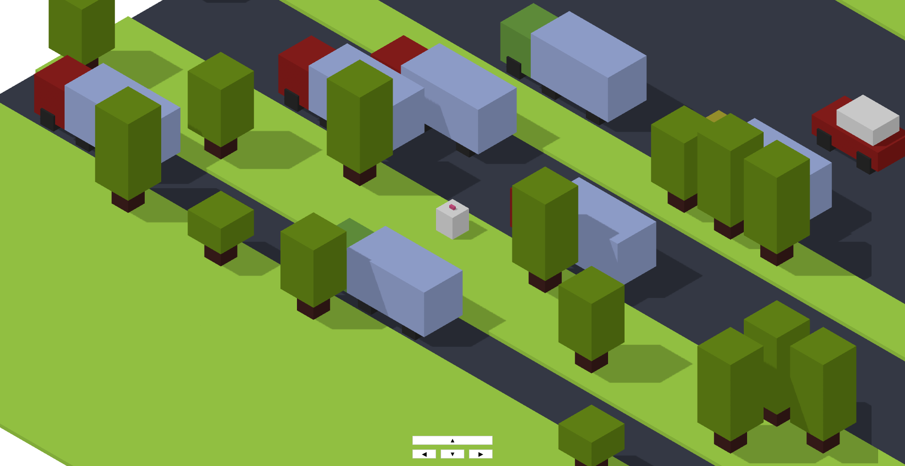

# crossyroad
A simple game built with Three.js



## Getting Started

Clone the repository:

```bash
git clone https://github.com/khalidhasananik/crossyroad.git
cd crossyroad
```

Install dependencies:

```bash
npm i
```

Run the development server:

```bash
npm run dev
```

Happy coding! 🚀
